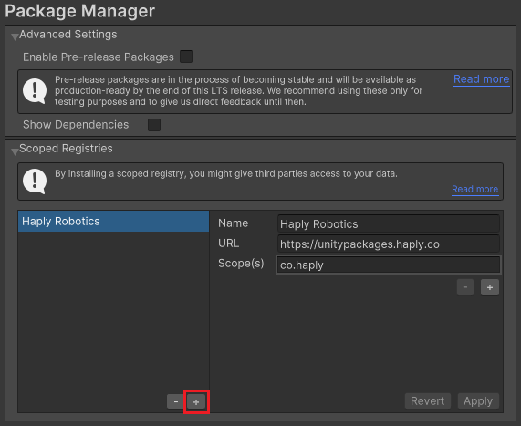
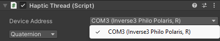
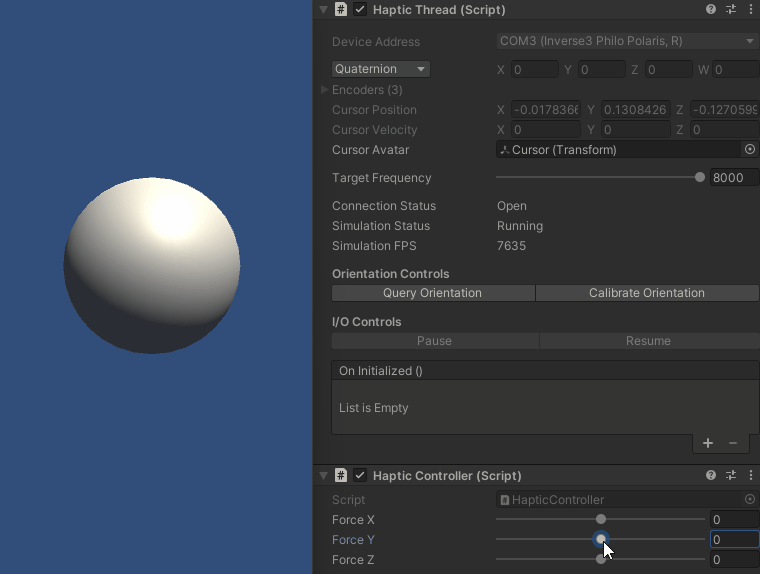
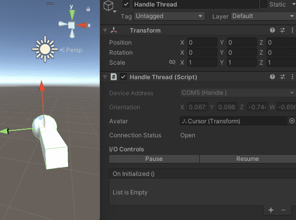

# Quick-Start: HardwareAPI Unity Package

This article provides basic setup instructions and a simple example demonstrating basic usage. For
details and advanced usage, see the
[Unity Package reference](https://docs.unity3d.com/Manual/Packages.html) or
[tutorials](#tutorials-and-unity-samples).

## Version support

- **Unity 2020.3.x LTS:** Recommended
- **Unity 2021.3.x LTS:** Supported
- **Unity 2022.x (Tech Stream):** Experimental

## Package Overview

The **Haply HardwareAPI** Unity Package is built on top of the Haply’s C# HardwareAPI class
libraries and provides additional integrations and quality-of-life features tailor-made for Unity
workflows.

The **Haptic Thread** and **Handle Thread** component handles communication with their respective
device in a thread-safe, asynchronous communication loop. Additionally, **Haptic Thread** provides
several methods for controlling the Inverse3. The package also automatically converts between
Unity’s coordinate system and the Inverse3’s.

> **Note** The package is under continuous development to further simplify development for the Inverse3.
> If you have any questions or requests, please [contact us](https://forum.haply.co/).

## Install the Haply Hardware API package

The HardwareAPI Unity package is distributed via the
[Scoped registry](https://docs.unity3d.com/Manual/upm-scoped.html)
feature of Unity’s package manager. This section covers the steps required to define a custom
registry and add the HardwareAPI package to a new project.

1. With a project open, navigate to **Edit > Project Settings > Package Manager** in the Unity
   toolbar and in the **Package Manager** window under the **Scoped Registry** section press a plus
   button and add the following:

    - Name: `Haply Robotics`
    - URL: `https://unitypackages.haply.co`
    - Scope(s): `co.haply`

   

   > As an alternative, you can also edit your
   > [project manifest](https://docs.unity3d.com/Manual/upm-manifestPrj.html) file directly.\
   > For more information on Unity Scoped Registry visit:
   > [docs.unity3d.com](https://docs.unity3d.com/Manual/upm-scoped.html)

2. Use Unity toolbar to navigate to **Window > Package Manager**
3. Click the **add +** button in the status bar and select **Add package by name**.

   
4. Enter `co.haply.hardwareapi` as the **Name** and click **Add**.

   

If successful, the package manager should display the following information.

  

## Getting started

### Controlling Inverse3

1. Create an empty **Game Object** under scene, name it **Haptic Thread** and from the inspector, add the **Haptic
   Thread** component on it.
2. In the **Haptic Thread** use the Device Address dropdown to select the Inverse3 device matching
   the name on its plate.

   
3. Add a sphere to the scene, name it **Cursor** and attach it to the **EE Avatar** in the
   **HapticThread**. If you enter Play Mode now, the sphere will move along with the cursor of the
   Inverse3, while position and velocity will be updated continuously in the inspector window.

4. Create a new C# script with the following code, then attach it to the same Game Object as the
   **Haptic Thread**:

    ```csharp
    using Haply.HardwareAPI.Unity;
    using UnityEngine;
    
    public class HapticController : MonoBehaviour
    {
        [Range(-2, 2)]
        public float forceX;
        [Range(-2, 2)]
        public float forceY;
        [Range(-2, 2)]
        public float forceZ;
        
        private void Awake()
        {
            var hapticThread = GetComponent<HapticThread>();
            hapticThread.onInitialized.AddListener(() => hapticThread.Run(ForceCalculation));
        }
    
        private Vector3 ForceCalculation(in Vector3 position)
        {
            return new Vector3(forceX, forceY, forceZ);
        }
    }
    ```
    - The `Awake` method gets the **Haptic Thread** and starts the haptic calculations in a separate
      thread. It then adds a listener to the `onInitialized` event, which, when invoked, will call
      the Run method and pass-in `ForceCalculation` method as the delegate argument.
    - `ForceCalculation` takes the force vector provided in the inspector window and sends it to the
      Inverse3.

5. Enter the play mode, the **Haptic Thread** will continuously update the device velocity and
   position in the inspector window. Explore the device workspace and try controlling the force
   output using the sliders.
   > **WARNING**: When changing forces, the Inverse3 will move so be sure to clear the workspace of
   > valuables and to hold the cursor. For more information see the Safe Use article.

   

The **HapticThread** component can control the haptic thread refresh rate using a slider. For best
results use a refresh rate of 1KHz or more.

The position provided by the **HapticThread** is directly measured using position sensors on the
device. The velocity, on the other hand, is calculated using a velocity estimation algorithm to
provide a signal that you do not need to filter. The **HapticThread** can also provide information
about the device’s power state, base orientation, and other states.

### Using a Handle

1. Create an empty **Game Object** under scene, name it **Handle Thread** and from the inspector, add the **Handle
   Thread** component on it.

2. In the inspector use the **Device Address** dropdown to select the Handle device matching the name on
   its tag

   

3. Add a Cube as child of the Cursor with following Transform values:
   - Position : `0, 0, -1`
   - Rotation : `0, 0, 0`
   - Scale :    `0.5, 0.5, 2`

4. Attach the Cursor to the **Handle Thread**’s **Avatar** property

5. Enter the play mode, the **Handle Thread** will continuously update the device orientation in the
   inspector window so moving the handle will rotate the Cursor.

   

> Doing that will update the rotation of the Cursor with Handle orientation while the position will be updated by the
> Inverse3 effector movements.


