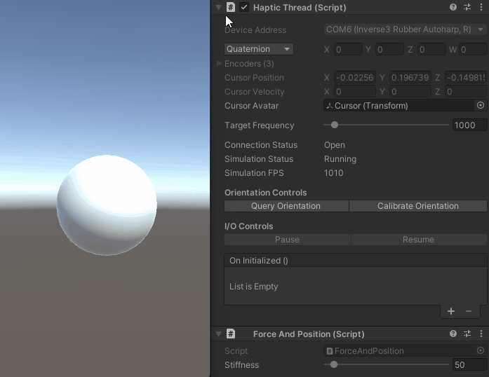

# Basic Force Output

This simple example explains how to apply forces and visualise the movement of an Inverse3
cursor. Completed example makes the Inverse3 feel like it is attached to its starting position with
a rubber band while a spherical GameObject  shows the cursor position.

# Introduction

The Quick Start Guide introduced the **Haptic Thread** object, its use, and how to generate
constant forces. Our goal is to create a rubber band effect on the cursor. A rubber band acts
like a spring i.e., its force depends on the stiffness and the distance between the two ends.
Therefore, we need to build a function that takes position and stiffness and outputs force such
that the cursor resists motion from the origin.

# Scene Setup

Start by creating a new script `ForceAndPosition.cs` and add the following code to
`ForceAndPosition` class:

```csharp
[Range(0, 800)]
public float stiffness = 200f;

private Vector3 m_initialPosition = Vector3.zero;

private Vector3 ForceCalculation(in Vector3 position)
{
    // save the first device effector position
    if (m_initialPosition == Vector3.zero)
        m_initialPosition = position;
    
    // return opposite force to stay at initial position
    return (m_initialPosition - position) * stiffness;
}
```

This code snippet defines stiffness as 200 Newtons per metre (N/m), which is a fairy soft spring.
It also defines `m_initialPosition` which is a vector that stores the initial cursor position.
The `ForceCalculation` method saves the initial position when it executes for the first time and
then calculates the force output that opposes cursor motion.

Finally add the following lines to the Awake method as shown in [Quick Start Guide][1]

```csharp
var hapticThread = GetComponent<HapticThread>();
hapticThread.onInitialized.AddListener(() => hapticThread.Run( ForceCalculation ));
```
The first line finds the **HapticThread** component attached to the GameObject, while the second
line starts it.

Now hold the Inverse3 cursor and enter Play Mode and then try moving the device. Notice that
moving the cursor results in a force and the further it moves from the starting point the greater
the force.



[1]: ../00_quick-start.md

## Source files

The final scene and all associated files used by this example can be imported from the **Force and
Position** sample in Unity's package manager.

```csharp
using Haply.HardwareAPI.Unity;
using UnityEngine;

public class ForceAndPosition : MonoBehaviour
{
    [Range(0, 800)]
    public float stiffness = 200f;
    
    private Vector3 m_initialPosition = Vector3.zero;
    
    private void Awake()
    {
        var hapticThread = GetComponent<HapticThread>();
        hapticThread.onInitialized.AddListener(() => hapticThread.Run(ForceCalculation) );
    }
    
    private Vector3 ForceCalculation(in Vector3 position)
    {
        if (m_initialPosition == Vector3.zero)
        {
            m_initialPosition = position;
        }
        return (m_initialPosition - position) * stiffness;
    }
}
```