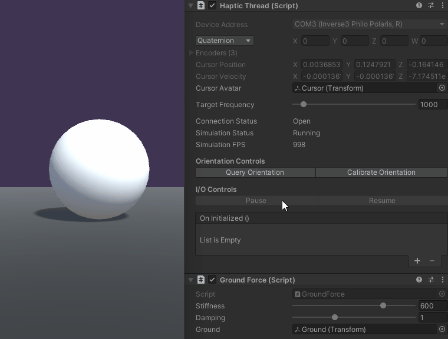

# Basic Force-Feedback

Physical objects have two properties that define how they feel, stiffness and damping. This tutorial
introduces haptic simulation incorporating both stiffness and damping resulting from contact with a
horizontal plane. Once completed, the simulation will give you an opportunity to feel a “floor” and
adjust its stiffness and damping characteristics.

## Introduction
The main challenge of this tutorial is developing a function that calculates the forces resulting
from the contact with a ground plane that exhibits both **stiffness** and **damping**.

Object stiffness acts like a spring; the more it compresses the higher the force. In contrast,
damping is an object's resistance to movement. For instance water has no stiffness but it has
damping so it provides no resistance when touching it slowly and lots of resistance when moving
quickly.

## Scene setup

Start by creating a **HapticThread** and a spherical Cursor visualizer as shown in the [Quick Start
Guide][1]. Next, create a Plane, name it Ground, and set its y position to -0.4. Create new C# Script
called GroundForce.cs, add it to the same GameObject as the HapticThread, and add the following
properties to the GroundForce class

[1]: ../00_quick-start.md

```csharp
[Range(0, 800)]
public float stiffness = 600f;
[Range(0, 3)]
public float damping = 1;

public Transform ground;
private float m_groundHeight;
private float m_cursorRadius;
```

When moving away from the plane Inverse3 should not generate any forces. Forces only appear when
the Cursor touches the plane surface i.e. the cursor penetrates the plane. The penetration depth
calculation depends not only on the plane position but also the Cursor visualization radius. In
this case, subtracting the Cursor radius from Inverse3 position is sufficient to correctly render
the relative location of the Cursor.

When Cursor touches the plane the resulting force depends on both Cursor’s position and velocity,
which are both provided by the Inverse3 (see Developing with Inverse3) which means that
ForceCalculation method is

```csharp
private Vector3 ForceCalculation ( in Vector3 position, in Vector3 velocity )
{
    var force = Vector3.zero;

    // Bottom of the sphere
    var contactPoint = position.y - m_cursorRadius;

    var penetration = m_groundHeight - contactPoint;
    if ( penetration > 0 )
    {
        force.y = penetration * stiffness - velocity.y * damping;
    }

    return force;
}
```

Next, update the `Awake` method to: assign `m_groundHeight` and `m_cursorRadius`, find the **HapticThread**,
and start it.
```csharp
private void Awake ()
{
    m_groundHeight = ground.transform.position.y;
    
    var hapticThread = GetComponent<HapticThread>();
    m_cursorRadius = hapticThread.avatar.lossyScale.y / 2;

    hapticThread.onInitialized.AddListener(() => hapticThread.Run( ForceCalculation ));
}
```
Finally, open the inspector window for the **GroundForce** script and assign the **Ground** plane to the
respective field. Start Game Mode and touch the ground plane. Experiment with different **stiffness**
and **damping** values and see the difference in the sensation the two create.



## Source files

The final scene and all associated files used by this example can be imported from the **Basic Force Feedback and Workspace Control** sample in Unity's package manager.

```csharp
using Haply.HardwareAPI.Unity;
using UnityEngine;

public class GroundForce : MonoBehaviour
{
    [Range(0, 800)]
    public float stiffness = 600f;
    [Range(0, 3)]
    public float damping = 1;
    
    public Transform ground;
    
    private float m_groundHeight;
    private float m_cursorRadius;

    private void Start ()
    {
        var hapticThread = GetComponent<HapticThread>();
        
        m_groundHeight = ground.transform.position.y;
        m_cursorRadius = hapticThread.avatar.lossyScale.y / 2;

        hapticThread.onInitialized.AddListener(() => hapticThread.Run( ForceCalculation ));
    }
    
    private Vector3 ForceCalculation ( in Vector3 position, in Vector3 velocity )
    {
        var force = Vector3.zero;

        var contactPoint = position.y - m_cursorRadius;
        var penetration = m_groundHeight - contactPoint;
        if ( penetration > 0 )
        {
            force.y = penetration * stiffness;
            force.y -= velocity.y * damping;
        }
        
        return force;
    }
}
```