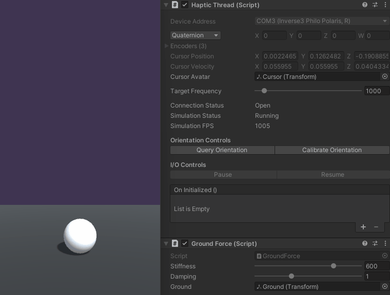

# Workspace Scaling and Placement

Haptic simulations attempt to replicate the geometry of physical objects that can be large or small.
Unity uses floating points in its internal calculations meaning that it is more efficient and more
accurate to use a large scene, on the scale of metres, and scale Inverse3’s motion rather than
scaling the scene down to Inverse3’s workspace. This tutorial builds on the [Generating Basic
Force-feedback](02.1_basic-force-feedback.md) tutorial to show how to scale motion and position the
workspace of the Inverse3 in a scene.

## Introduction

To scale **Cursor** movement, we will create a **Haptic Workspace** GameObject and place the **Cursor**
sphere as its child. The **Haptic Workspace** translation also provides control over the
position of the Inverse3 relative to the scene, meaning the **Cursor** motion can be moved to a
different location without moving the scene.

Before starting, complete the [Generating Basic Force-feedback](02.1_basic-force-feedback.md)
tutorial and open the project. Next, create an empty GameObject, name it **Haptic Workspace**, and
set its scale to `(10, 10, 10)`. For this example, a scale of 10 will make a 1 m object in the scene
feel like it is only 10 cm, but you can set it to any positive number.

**Haptic Workspace**, also, allows you to position the device workspace relative to the scene by
simply changing its position. In this example, you can move the workspace up and down.

In the hierarchy window, drag the **Cursor** object onto the **Haptic Workspace** to make it
**Haptic Workspace**’s child.

Also, `HapticThread `and `GroundForce` scripts can be moved from the **Haptic Thread** GameObject to
the **Haptic Workspace** and **Haptic Thread** which is now empty and useless, can be deleted.


Now, open `GroundForce.cs` and add the following members:

```csharp
private float m_workspaceScale;
private float m_workspaceHeight;
```

`m_workspaceScale` holds the scaling factors of the **Haptic Workspace** set in the previous step
while `m_workspaceHeight` represents the in scene position offset of the workspace on Y-axis. Next,
initialise the two variables in the `Awake` method by adding

```csharp
m_workspaceScale = hapticThread.avatar.parent.lossyScale.y;
m_workspaceHeight = hapticThread.avatar.parent.position.y;
```

Now, update `ForceCalculation` such that it accounts for both position offset and the change of
scale when calculating `contactPoint` by replacing

```csharp
var contactPoint = position.y - m_cursorRadius;
```

with,

```csharp
var contactPoint = (position.y * m_workspaceScale) + m_workspaceHeight - m_cursorRadius;
```

Scaled motion will cause the forces to scale along with the scene. To avoid this, the force
calculations must eliminate position scaling by dividing by the scaling factor `m_workspaceScale`
such that

```csharp
force.y = penetration * stiffness;
```

becomes,

```csharp
force.y = (penetration / m_workspaceScale) * stiffness;
```

> Notice, that `velocity` is never scaled up or down.

When you enter play mode, you will notice that the **Cursor** motion will be more pronounced but the
**Cursor** readings in the inspector window stay the same. You can also move the workspace using the
position parameters of the **Haptic Workspace**.

> Note that the haptic calculations will generate a force across the plane as if it was infinite, so
> moving the workspace sideways will only affect the visualisation.




## Source files

The final scene and all associated files used by this example can be imported from the **Basic Force
Feedback and Workspace Control** sample in Unity's package manager.

### GroundForce.cs

```csharp
using Haply.HardwareAPI.Unity;
using UnityEngine;

public class GroundForce : MonoBehaviour
{
[Range(0, 800)]
public float stiffness = 600f;

    public Transform ground;

    private float m_groundHeight;
    private float m_cursorRadius;

    // Cursor Offset
    private float m_workspaceScale;
    private float m_workspaceHeight;

    private void Awake ()
    {
        var hapticThread = GetComponent<HapticThread>();
        
        m_groundHeight = ground.transform.position.y;
        m_cursorRadius = hapticThread.avatar.lossyScale.y / 2;
        
              m_workspaceScale = hapticThread.avatar.parent.lossyScale.y;
              m_workspaceHeight = hapticThread.avatar.parent.position.y;

        hapticThread.onInitialized.AddListener(() => hapticThread.Run( ForceCalculation ));
    }
    
    private Vector3 ForceCalculation ( in Vector3 position, in Vector3 velocity )
    {
        var force = Vector3.zero;

        // Contact point scaled by parent offset
        var contactPoint = (position.y * m_workspaceScale) + m_workspaceHeight - m_cursorRadius;
        
        var penetration = m_groundHeight - contactPoint;
        if ( penetration > 0 )
        {
            force.y = (penetration / m_workspaceScale);;
            force.y -= velocity.y * damping;
        }
        return force;
    }
}
```