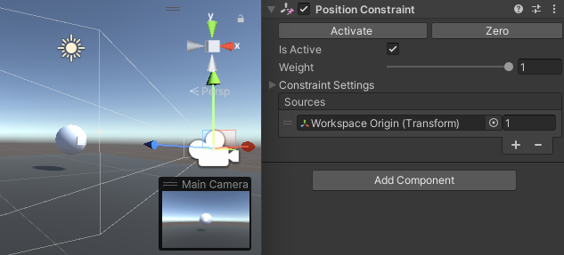

# Workspace Navigation

This tutorial shows how to adjust the cursor scaling using the handle, providing the user control
over precision and size of navigable workspace building.

This example builds on the scene created
in [Workspace Scaling and Placement](02.2_haptic-workspace.md) by providing handle-based control
over the **Haptic Workspace**. The goal is to use the handle button to trigger workspace offsetting
and use the cursor position to change it, and to the second one to trigger workspace resizing and
use handle roll to change it.

To this end, when the user presses a button the **WorkspaceOffsetController** script saves the last
known cursor position and stops updating the avatar location. Alternatively, the **WorkspaceScaleController** saves the workspace scale and current handle orientation when a button
is pressed. As a result of using the two scripts together, moving the cursor will create a new
cursor offset while rotating the handle will change the workspace scaling. In this implementation,
CCW rotation around the Z axis corresponds to reducing the workspace scaling and vice versa. When
the user releases the button, the two offsets will stop changing and the cursor avatar will move
once more.

## Scene setup

Start by adding the **HandleTread** component to the **Haptic Workspace** GameObject. In the
inspector view, set the **Cursor** as **HandleThread** Avatar then add a cube as a child of the
cursor to visualise its rotation _(see [Quick Start Guide](../00_quick-start.md) for more details)_.


## The WorkspaceOffsetController component

Create a new script `WorkspaceOffsetController.cs` and add it to the **Haptic Workspace**
GameObject. Then add a reference to the cursor controlled by the **HapticThread**

```csharp
    private Transform m_cursor;

    private void Awake()
    {
        m_cursor = GetComponent<HapticThread>().avatar;
    }
```

Then the following properties :

```csharp
private Vector3 m_basePosition;
private Vector3 m_cursorBasePosition;
```

`m_basePosition` saves the workscape position prior to any modification,
while `m_cursorBasePosition` saves the cursor position.

Next, add the `active` encapsulated field corresponding to the button state which initialises the
previous fields and enables the workspace offsetting on each update:

```csharp
public bool active
{
    get => m_active;
    set
    {
        if (value)
        {
            m_basePosition = transform.localPosition;
            m_cursorBasePosition = m_cursor.localPosition;
        }
        m_active = value;
    }
}
private bool m_active;
```

Finally, add `Update` which, when active, changes the workspace offset by calculating the change in
cursor position relative to the base position. Note that the position change needs to be scaled by
the workspace transform to remain accurate.

```csharp
private void Update()
{
    if (active)
    {
        // Move cursor offset relative to cursor position 
        transform.position = m_basePosition - Vector3.Scale(m_cursor.localPosition - m_cursorBasePosition, transform.lossyScale);
    }
}
```

To bind the handle button to the active field, select the **Haptic Workspace** and from the
inspector panel, add (**Haptic Workspace**)`WorkspaceOffsetController.active = false`
to `OnButtonUp()` event and (**Haptic Workspace**)`WorkspaceOffsetController.active = true`
to `OnButtonDown()`.


### Optional: Binding the camera movement

Changing the cursor offset can be made intuitive by moving the camera along with the workspace. As a
result, even if the offset is large, the cursor will never move out of frame.


To achieve this add a **Position Constraint** component to the **Main Camera**, set the *
***Haptic Workspace**** as source, and press the **Activate** button.



## The WorkspaceScaleController component

Create a new script `WorkspaceScaleController.cs` and add it to the **Haptic Workspace** GameObject.
Then add a reference to the cursor controlled by the **HandleThread**

```csharp
private Transform m_cursor;

private void Awake()
{
    m_cursor = GetComponent<HandleThread>().avatar;
}
```

Then add the following settings:

```csharp
public float scalingFactor = 0.25f;
public float minimumScale = 1f;
public float maximumScale = 20f;
```


`scalingFactor` converts the rotation of the handle in degrees into a numeric scale which is bound
by the `minimumScale` and the `maximumScale`.

Then add the following fields:

```csharp
private float m_baseScale;
private float m_cursorBaseAngle;
```

`m_baseScale` saves the workscape scale prior to any modification, while `m_cursorBaseAngle` saves
the cursor orientation on the Y-axis.

Next, add `GetTotalDegrees` method:

```csharp
private float m_cursorPreviousAngle;
private int m_rotationCount;

private float GetTotalDegrees(float currentAngle, float baseAngle)
{
    if (currentAngle - m_cursorPreviousAngle > 330)
        m_rotationCount--;
    else if (m_cursorPreviousAngle - currentAngle > 330)
        m_rotationCount++;
    
    m_cursorPreviousAngle = currentAngle;
    
    return 360f * m_rotationCount + (currentAngle - baseAngle);
}
```

The handle can rotate more than once around its own axis which can lead to sudden jumps in the
displacement when crossing 0°. This function checks the current angle against the previous angle and
detects when 0° has been crossed and in which direction guaranteeing that the returned angle offset
is accurate, even if more than one complete rotation took place.

Next, the `active` encapsulated field, corresponding to the button state, which initialises previous
fields and enables the workspace scaling on each update:

```csharp
public bool active
{
    get => m_active;
    set
    {
        if (value)
        {
            m_rotationCount = 0;
            m_baseScale = transform.localScale.z;
            m_cursorPreviousAngle = m_cursorBaseAngle = m_cursor.localEulerAngles.z;

        }
        m_active = value;
    }
}
private bool m_active;
```

Finally, add `Update` which, if active, modifies the transforms of the **Haptic Workspace** based on
the handle angle.

```csharp
private void Update()
{
    if (active)
    {
        // Calculate scale relative to cursor roll on Z-axis rotation
        var totalDegrees = GetTotalDegrees(m_cursor.localEulerAngles.z, m_cursorBaseAngle);
        var scale = m_baseScale - totalDegrees * scalingFactor / 100f;
        
        // Limit between minimumScale and maximumScale
        scale = Mathf.Clamp(scale, minimumScale, maximumScale);

        // Set cursor offset scale (same on each axis)
        transform.localScale = Vector3.one * scale;
        // Invert cursor scale to keep its original size
        m_cursor.localScale = Vector3.one / scale;
    }
}
```

### Binding handle button

As before, to bind the handle button to the `active` field, select the **Haptic Workspace** and from
the inspector panel, add (**Haptic Workspace**)`WorkspaceScaleController.active = false`
to `OnButtonUp()` event and (**Haptic Workspace**)`WorkspaceScaleController.active = true`
to `OnButtonDown()`.


## Result

Now you can easily navigate in the scene by scaling and moving the workspace by pressing the Handle
button.


## Source files
The final scene and all associated files used by this example can be imported from the **Basic Force Feedback and Workspace Control** sample in Unity's package manager.
The Unity Sample contains additional quality of life improvements that were outside of the scope of this tutorial:

* A transparent bubble visualising the the workspace size
* Keyboard shortcuts
  * Pressing `M` key makes workspace move only
  * Pressing `S` key makes workspace scale only
* A UI to display current offset and scale values

### `WorkspaceOffsetController.cs`

```csharp
using Haply.HardwareAPI.Unity;
using UnityEngine;

public class WorkspaceOffsetController : MonoBehaviour
{
// Movable cursor with position controlled by Haptic Thread
private Transform m_cursor;

    // Saved workspace and cursor values at transformation beginning
    private Vector3 m_basePosition;
    private Vector3 m_cursorBasePosition;

    // If true, the workspace offset is set relatively to the cursor position on each Update() loop
    public bool active
    {
        get => m_active;
        set
        {
            if (value)
            {
                m_basePosition = transform.localPosition;
                m_cursorBasePosition = m_cursor.localPosition;
            }
            m_active = value;
        }
    }

    private bool m_active;
    
    private void Awake()
    {
        // Get the moving cursor from the HapticThread
        m_cursor = GetComponent<HapticThread>().avatar;
    }

    private void Update()
    {
        if (active)
        {
            // Update the workspace offset relative to cursor position 
            transform.position = m_basePosition - Vector3.Scale(m_cursor.localPosition - m_cursorBasePosition, transform.lossyScale);
        }
    }
}
```

### `WorkspaceScaleController.cs`

```csharp
using System;
using Haply.HardwareAPI.Unity;
using UnityEngine;

public class WorkspaceScaleController : MonoBehaviour
{
// Movable cursor with rotation controlled by Handle Thread
private Transform m_cursor;

    [Tooltip("Sensitivity of scaling on handle rotation")]
    public float scalingFactor = 3f;
    public float minimumScale = 1f;
    public float maximumScale = 5f;
    
    // Saved workspace and cursor values at transformation beginning
    private float m_baseScale;
    private float m_cursorBaseAngle;
    private float m_cursorPreviousAngle;
    private int m_rotationCount;

    // If enabled the workspace will be uniformly scaled relatively to cursor roll (Z-axis rotation) on each Update() loop
    public bool active
    {
        get => m_active;
        set
        {
            if (value)
            {
                m_rotationCount = 0;
                m_baseScale = transform.localScale.z;
                m_cursorPreviousAngle = m_cursorBaseAngle = m_cursor.localEulerAngles.z;
            }
            m_active = value;
        }
    }
    private bool m_active;
    
    private void Awake()
    {
        // Get the rotating cursor from the HandleThread
        m_cursor = GetComponent<HandleThread>().avatar;
    }
    
    private void Update()
    {
        if (active)
        {
            // Calculate scale relative to cursor roll on Z-axis rotation
            var totalDegrees = GetTotalDegrees(m_cursor.localEulerAngles.z, m_cursorBaseAngle);
            var scale = m_baseScale - totalDegrees * scalingFactor / 100f;
            
            // Limit between minimumScale and maximumScale
            scale = Mathf.Clamp(scale, minimumScale, maximumScale);

            // Set cursor offset scale (same on each axis)
            transform.localScale = Vector3.one * scale;
            // Invert cursor scale to keep its original size
            m_cursor.localScale = Vector3.one / scale;
        }
    }

    // Return the total degrees between baseAngle and currentAngle over the 360 degrees limitation
    private float GetTotalDegrees(float currentAngle, float baseAngle)
    {
        if (currentAngle - m_cursorPreviousAngle > 330)
            m_rotationCount--;
        else if (m_cursorPreviousAngle - currentAngle > 330)
            m_rotationCount++;
        
        m_cursorPreviousAngle = currentAngle;
        
        return 360f * m_rotationCount + (currentAngle - baseAngle);
    }
}
```
