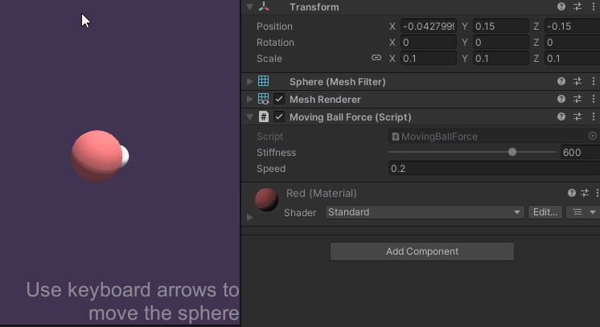

# Object-Based Force-Feedback

Because the haptic thread can be an order of magnitude faster than the physics
thread, multiple haptic updates can occur between each `FixedUpdate()`
call. This leads to inconsistencies between the scene data used to calculate physics changes, and the
data in the haptic thread used to calculate haptic feedback.

In this example, we show a thread safe approach to synchronising scene data
with the haptic loop.

## Scene setup

- Add a **Haptic Thread** and **Cursor** as was shown in [Force and Cursor
  Position][1]
- Create a **Sphere** called **Moving Ball** and set its position to `(0, 0.15,
  -0.15)` and its scale to `(0.1, 0.1, 0.1)`

[1]: 01_force-and-position.md

## The Haptic Loop

Add a new **C# Script** called `MovingBallForce.cs` to the **Moving Ball** game object. The source for this script is given below.

```csharp
using Haply.HardwareAPI.Unity;
using UnityEngine;

public class MovingBallForce : MonoBehaviour
{
    // Thread-safe scene data struct
    private struct AdditionalData
    {
        public Vector3 ballPosition;
        
        // cursor radius + ball radius
        public float radiuses;
    }
    
    [Range(0, 800)]
    public float stiffness = 600f;
    
    // Moving/scaling speed (by pressing arrow keys)
    public float speed = 0.2f;
    
    private HapticThread m_hapticThread;

    private void Awake ()
    {
        // Find the HapticThread object before the our first FixedUpdate() call
        m_hapticThread = FindObjectOfType<HapticThread>();
        
        // Run the haptic loop with an initial state returned by AdditionalData.
        var initialState = GetAdditionalData();
        m_hapticThread.onInitialized.AddListener(() => m_hapticThread.Run(ForceCalculation, initialState));
    }

    private void FixedUpdate ()
    {
        // Change the scale of the ball
        if ( Input.GetKey( KeyCode.UpArrow ) )
            transform.localScale += Vector3.one * (Time.fixedDeltaTime * speed);
        else if ( Input.GetKey( KeyCode.DownArrow ) )
            transform.localScale -= Vector3.one * (Time.fixedDeltaTime * speed);

        // Move the ball
        if ( Input.GetKey( KeyCode.LeftArrow ) )
            transform.transform.position += Vector3.left * (Time.fixedDeltaTime * speed);
        else if (Input.GetKey(KeyCode.RightArrow))
            transform.transform.position += Vector3.right * (Time.fixedDeltaTime * speed);

        // Update AdditionalData with the latest physics data
        m_hapticThread.SetAdditionalData(GetAdditionalData());
    }

    // Method used by HapticThread.Run(ForceCalculation) and HapticThread.GetAdditionalData()
    // to synchronize dynamic data between the unity scene and the haptic thread 
    private AdditionalData GetAdditionalData ()
    {
        AdditionalData additionalData;

        additionalData.ballPosition = transform.localPosition;
        additionalData.radiuses = (transform.localScale.x + m_hapticThread.avatar.localScale.x) / 2f;

        return additionalData;
    }

    // Calculate the force to apply when the cursor touches the ball.
    // This is done through additionalData to keep things thread-safe.
    private Vector3 ComputeForce ( in Vector3 position, in Vector3 velocity, in AdditionalData additionalData )
    {
        var force = Vector3.zero;

        var distance = Vector3.Distance( position, additionalData.ballPosition );

        if ( distance < additionalData.radiuses )
        {
            var penetration = additionalData.radiuses - distance;
            force = (position - additionalData.ballPosition) / distance * penetration * stiffness;
        }

        return force;
    }
}
```

Enter play mode and use the arrow keys to move and resize the sphere. You should both see and feel the changes in the sphere's size and position.



## Source files

The final scene and all associated files used by this example can be imported from Unity's package manager.
