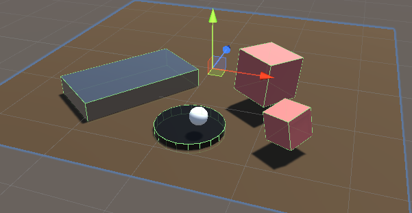
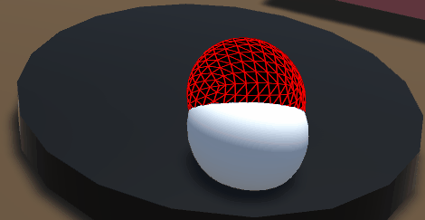
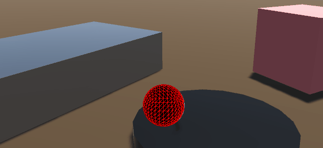
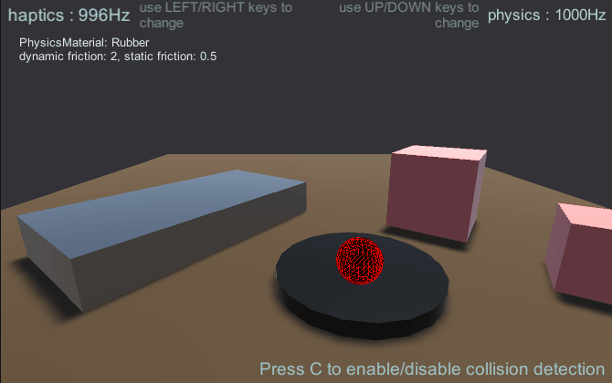

# Physics-Based Force-Feedback

Previous examples rendered primitive objects like a plane or a sphere where the force-feedback
calculations were coded by hand due to their simplicity. As the objects become more complex, manual
calculations become cumbersome and complicated. Physics engines like SOFA, IMSTK, and CHAI3D are
heavily optimized for haptic applications allowing them to execute at frequencies above 1000 Hz
creating realistic haptic simulations but they require integration into Unity. Unity has a built in
physics engine which can be used for simple simulations. This article shows how to build a haptic
scene and incorporate the physics engine into a haptic simulation using kinematic and non-kinematic
objects.

## Introduction

Unity has two types of RigidBodies kinematic and non-kinematic. Kinematic objects are controlled by
scripts like the Cursor in previous examples. In contrast, non-kinematic bodies are controlled by
collisions and the resulting forces. The challenge lies in exchanging force data between the user
and the non-kinematic object, as neither the force input nor the force output can be measured
directly.

To get around this issue, we employ ConfigurableJoints to create a virtual coupling which joins a
kinematic and a non-kinematic object with a virtual linkage composed of a spring and a damper.
Effectively, when a non-kinematic object collides with another non-kinematic object, it will be
impeded from moving but the kinematic object will continue moving, stretching the spring and
creating a force. We can use the resulting force directly to render the objects.

## Scene setup

The implementation for this relies on using two objects in tandem:

- The **Cursor** object (kinematic), which will match your device's cursor position
- The **PhysicEffector** (non-kinematic), which will be linked to the **Cursor**
  object via a fixed joint.

The force rendered by your device will be relative to the distance between these two objects, such
that when the **PhysicsEffector** object is blocked by another object in the scene, an opposing
force proportional to the distance from the **Cursor** object will be generated.

- Add a **Haptic Thread** and **Cursor** as was shown in [Quick Start Guide][1].
- Create a **Workspace** as shown in [Workspace Scaling and Placement][2].
- Create a Sphere called **Physics Effector** under **Haptic Workspace** with the
  same transform values as **Cursor**.
- Add various 3D objects with colliders in the scene.
- Add a Cube with a rigid body, its gravity enabled and a mass of `1000`.



> optional: You can set the built-in `SpatialMappingWideframe` material on
**PhysicEffector** to see how the sphere rotates as you move it across the surface because of the
> friction.
> 

[1]: ../00_quick-start.md

[2]: 02.2_haptic-workspace.md

## Simple physics haptic loop

Add a new **C# Script** called `SimplePhysicsHapticEffector.cs` to the
**PhysicEffector** game object. The source for this script is given below.

```csharp
using Haply.HardwareAPI.Unity;
using UnityEngine;

public class SimplePhysicsHapticEffector : MonoBehaviour
{
    // Thread safe scene data
    private struct AdditionalData
    {
        public Vector3 physicEffectorPosition;
    }

    public bool forceEnabled;
    [Range(0, 800)]
    public float stiffness = 400f;
    [Range(0, 3)]
    public float damping = 1;

    private HapticThread m_hapticThread;

    private void Awake ()
    {
        // Find the HapticThread object before the first FixedUpdate() call.
        m_hapticThread = FindObjectOfType<HapticThread>();

        // Create the physics link between the physic effector and the device cursor
        AttachCursor( m_hapticThread.avatar.gameObject );
    }

    private void OnEnable ()
    {
        // Run haptic loop with AdditionalData method to get initial values
        if (m_hapticThread.isInitialized)
            m_hapticThread.Run(ForceCalculation, GetAdditionalData());
        else
            m_hapticThread.onInitialized.AddListener(() => m_hapticThread.Run(ForceCalculation, GetAdditionalData()) );
    }

    private void FixedUpdate () =>
        // Update AdditionalData
        m_hapticThread.SetAdditionalData( GetAdditionalData() );

    // Attach the current physics effector to the device end-effector with a fixed joint
    private void AttachCursor (GameObject cursor)
    {
        // Add a kinematic rigidbody to the cursor.
        var rbCursor = cursor.GetComponent<Rigidbody>();
        if ( !rbCursor )
        {
            rbCursor = cursor.AddComponent<Rigidbody>();
            rbCursor.useGravity = false;
            rbCursor.isKinematic = true;
        }

        // Add a non-kinematic rigidbody to self
        if ( !gameObject.GetComponent<Rigidbody>() )
        {
            var rb = gameObject.AddComponent<Rigidbody>();
            rb.useGravity = false;
        }

        // Connect self to the cursor rigidbody
        if ( !gameObject.GetComponent<FixedJoint>() )
        {
            var joint = gameObject.AddComponent<FixedJoint>();
            joint.connectedBody = rbCursor;
        }
    }

    // Method used by HapticThread.Run(ForceCalculation) and HapticThread.GetAdditionalData()
    // to synchronize the physic effector position information between the physics thread and the haptic thread.
    private AdditionalData GetAdditionalData ()
    {
        AdditionalData additionalData;
        additionalData.physicEffectorPosition = transform.localPosition;
        return additionalData;
    }

    // Calculate the force to apply based on the distance between the two effectors.
    private Vector3 ForceCalculation ( in Vector3 position, in Vector3 velocity, in AdditionalData additionalData )
    {
        if ( !forceEnabled )
        {
            return Vector3.zero;
        }
        var force = additionalData.physicEffectorPosition - position;
        force *= stiffness;
        force -= velocity * damping;
        return force;
    }
}
```

With this setup you should be able top feel each object in scene, with heavier objects offering more
resistance.



**Problems:**

- The feeling of **friction/drag** is caused by the difference in update
  frequency between Unity's physics engine (between 60Hz to 120Hz) and the haptics
  thread (~1000Hz). This difference means that the physics effector will always be
  lagging behind the Cursor's true position which leads to forces that resemble a
  step function instead of being continuous.
- No real haptics on **moving objects**.

**Solutions:**

- Decrease the value of `ProjectSettings.FixedTimestep` as close to `0.001` as
  possible. This change will have significant impact on performances for complex
  scenes.
- Apply forces only when collisions occur _(see the next example)_
- Use a third-party physics/haptic engine like (TOIA, SOFA, etc...) as a
  middleware between unity's physics engine and the haptic loop to simulate the
  contact points at a higher frequency.

## More advanced physics haptic loop

In this example we will:

- Use the **collision detection** output to avoid the feeling of friction/drag
  when the effector isn't in contact with an object.

- A **ConfigurableJoint** with a limit, spring and damper as link between the
  two effectors instead of a **FixedJoint**. This will allow us to use Unity's
  **PhysicsMaterials** to set different friction values on the objects in the
  scene and feel the mass of an movable object through the force feedback.

On the **Physic Effector** game object, replace the
**SimplifiedPhysicsHapticsEffector** script component by a new **C# Script**
called `AdvancedPhysicsHapticEffector.cs`

```csharp
using Haply.HardwareAPI.Unity;
using System.Collections.Generic;
using UnityEngine;

public class AdvancedPhysicsHapticEffector : MonoBehaviour
{
    /// Thread-safe scene data
    private struct AdditionalData
    {
        public Vector3 physicEffectorPosition;
        public bool isTouching;
    }

    public bool forceEnabled;

    [Range(0, 800)]
    public float stiffness = 400f;
    [Range(0, 3)]
    public float damping = 1;

    private HapticThread m_hapticThread;

    // Apply forces only when we're colliding with an object which prevents feeling
    // friction/drag while moving through the air.
    public bool collisionDetection = true;

    private List<Collider> m_Touched = new();

    private void Awake ()
    {
        // Find the HapticThread object before the first FixedUpdate() call.
        m_hapticThread = FindObjectOfType<HapticThread>();

        // Create the physics link between the physic effector and the device cursor
        AttachCursor( m_hapticThread.avatar.gameObject );
    }

    private void OnEnable ()
    {
        // Run haptic loop with AdditionalData method to get initial values
        if (m_hapticThread.isInitialized)
            m_hapticThread.Run(ForceCalculation, GetAdditionalData());
        else
            m_hapticThread.onInitialized.AddListener(() => m_hapticThread.Run(ForceCalculation, GetAdditionalData()) );
    }

    private void FixedUpdate () =>
        // Update AdditionalData with the latest physics data.
        m_hapticThread.SetAdditionalData( GetAdditionalData() );

    /// Attach the current physics effector to the device end-effector with a joint
    private void AttachCursor (GameObject cursor)
    {
        // Add a kinematic rigidbody to the cursor.
        var rbCursor = cursor.AddComponent<Rigidbody>();
        rbCursor.useGravity = false;
        rbCursor.isKinematic = true;

        // Add a non-kinematic rigidbody to self.
        var rb = gameObject.AddComponent<Rigidbody>();
        rb.useGravity = false;
        rb.drag = 80f; // stabilize spring connection

        // Connect self with the cursor rigidbody via a spring/damper joint and a locked rotation.
        var joint = gameObject.AddComponent<ConfigurableJoint>();
        joint.connectedBody = rbCursor;
        joint.anchor = joint.connectedAnchor = Vector3.zero;
        joint.axis = joint.secondaryAxis = Vector3.zero;

        // Limit linear movements.
        joint.xMotion = joint.yMotion = joint.zMotion = ConfigurableJointMotion.Limited;

        // Configure the limit, spring and damper
        joint.linearLimit = new SoftJointLimit()
        {
            limit = 0.001f
        };
        joint.linearLimitSpring = new SoftJointLimitSpring()
        {
            spring = 500000f,
            damper = 10000f
        };

        // Lock the rotation to prevent the sphere from rolling due to friction with the material which will
        // improve the force-feedback feeling.
        joint.angularXMotion = joint.angularYMotion = joint.angularZMotion = ConfigurableJointMotion.Locked;


        // Set the first collider which handles collisions with other game objects.
        var sphereCollider = gameObject.GetComponents<SphereCollider>();
        sphereCollider.material = new PhysicMaterial {
                dynamicFriction = 0,
                staticFriction = 0
        };


        // Set the second collider as a trigger that is a bit larger than our first collider. It will be used to
        // detect when our effector is moving away from an object it was touching.
        var trigger = gameObject.AddComponent<SphereCollider>();
        trigger.isTrigger = true;
        trigger.radius = sphereCollider.radius * 1.08f;
    }

    // Method used by HapticThread.Run(ForceCalculation) and HapticThread.GetAdditionalData()
    // to synchronize the physic effector position information between the physics thread and the haptic thread
    private AdditionalData GetAdditionalData ()
    {
        AdditionalData additionalData;
        additionalData.physicEffectorPosition = transform.localPosition;
        additionalData.isTouching = collisionDetection && m_Touched.Count > 0;
        return additionalData;
    }

    // Calculate the force to apply based on the distance between the two effectors
    private Vector3 ForceCalculation ( in Vector3 position, in AdditionalData additionalData )
    {
        if ( !forceEnabled || (collisionDetection && !additionalData.isTouching) )
        {
            // Don't compute forces if there are no collisions which prevents feeling drag/friction while moving through air.
            return Vector3.zero;
        }
        var force = additionalData.physicEffectorPosition - position;
        force *= stiffness;
        return force;
    }

    private void OnCollisionEnter ( Collision collision )
    {
        if ( forceEnabled && collisionDetection && !m_Touched.Contains( collision.collider ) )
        {
            // Store the object that our effector is touching.
            m_Touched.Add( collision.collider );
        }
    }

    private void OnTriggerExit ( Collider other )
    {
        if ( forceEnabled && collisionDetection && m_Touched.Contains( other ) )
        {
            // Remove the object when our effector moves away from it.
            m_Touched.Remove( other );
        }
    }

}
```

## Source files

The final scene and all associated files used by this example can be imported from Unity's package
manager.

**Additional features:**

- Choose between simplified or advanced physics effector by pressing the `1` or
  `2` key.
- Control the **Haptics framerate** with the `LEFT`/`RIGHT` keys.
- Control the **Physics framerate** with the `UP`/`DOWN` keys.
- Toggle **Collision Detection** with the `C` key.
- Toggle **Force feedback** with the `SPACE` key.
- A prepared scene with static ans dynamic objects that have different **mass**
  and **PhysicsMaterials**.
- A UI to display the properties of touched objects _(static/dynamic friction,
  mass, drag...)_


