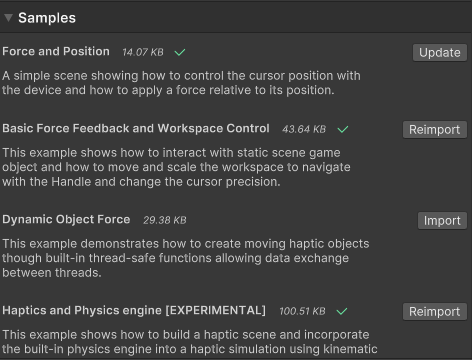

## Tutorials and Unity Samples

The package includes sample projects which can also find in form of tutorials:



You can follow and reproduce the step-by-step instructions or you can either import the sources
files to your project from the [Unity Package Manager](https://docs.unity3d.com/Manual/upm-ui.html).

